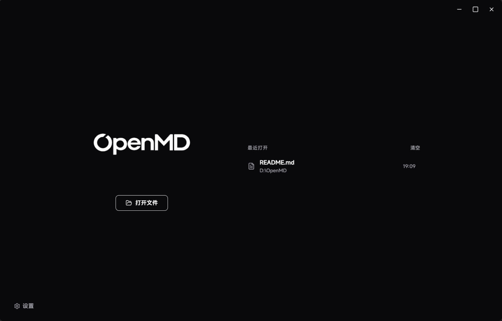
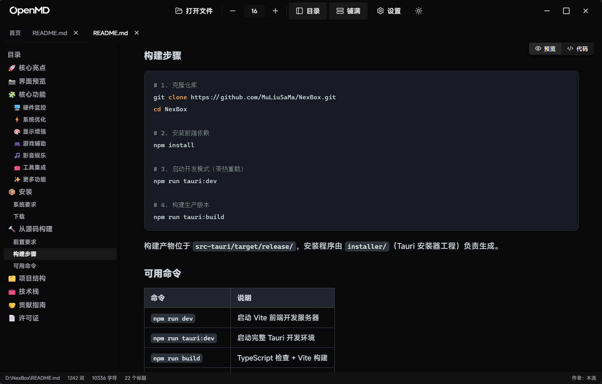
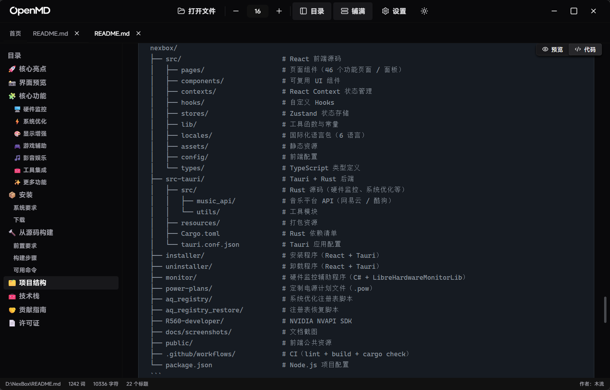
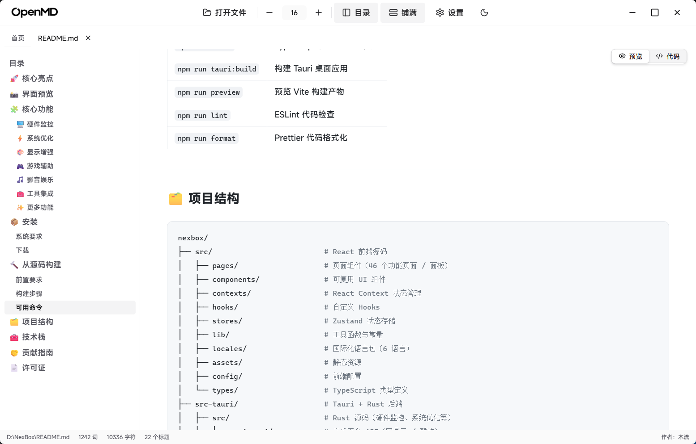
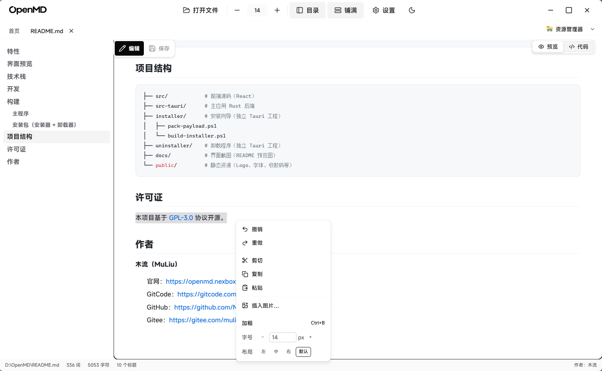

<p align="center">
  
</p>

<p align="center">本地优先的 Markdown 阅读器 — 为阅读而生，快速、干净、无干扰。</p>

<p align="center">
  <a href="https://github.com/MuLiuSaMa/OpenMD/releases">
    
  </a>
  <a href="https://github.com/MuLiuSaMa/OpenMD">
    
  </a>
  <a href="https://gitcode.com/MuLiuSaMa/OpenMD">
    
  </a>
  <a href="https://github.com/MuLiuSaMa/OpenMD/releases">
    
  </a>
  
  
  
  
</p>

<p align="center">
  <a href="https://openmd.nexbox.cn">
    
  </a>
  <a href="https://github.com/MuLiuSaMa/OpenMD"></a>
  <a href="https://gitee.com/muliuawa/OpenMD"></a>
  <a href="https://gitcode.com/MuLiuSaMa/OpenMD"></a>
</p>

## 特性

-   **沉浸阅读**：无边框窗口、黑白灰主题、亮暗色一键切换（View Transitions 平滑过渡）
-   <span style="font-weight: 650;">即时编辑</span>：可视化编辑MarkDown，快捷菜单。
-   **双视图**：渲染预览 / 源码高亮（highlight.js），均支持左侧目录导航与滚动同步
-   **舒适排版**：字号调节（滑动动画）、铺满模式、悬浮滚动条
-   **多标签页**：鼠标中键关闭标签，与浏览器操作习惯一致
-   **最近打开**：首页最近文档列表，支持单条删除与一键清空
-   **文件关联**：双击 `.md` / `.markdown` / `.mdown` / `.mkd` 直接打开（单实例转发）
-   **自动更新**：从 GitCode Release 检查新版本，应用内下载并重启安装
-   **自定义安装器**：独立安装/卸载向导，安装时可选关联 .md 文件，卸载时自动清理

## 界面预览

<p align="center"><span style="font-family: MiSans, -apple-system, BlinkMacSystemFont, &quot;Segoe UI Variable&quot;, &quot;Segoe UI&quot;, &quot;Microsoft YaHei UI&quot;, &quot;Microsoft YaHei&quot;, sans-serif; font-style: normal; font-variant-ligatures: normal; font-variant-caps: normal; font-weight: 400; font-size: 15px;">主页 — 最近文档</span></p>

<p align="center">    
    
</p>

<p dir="auto" align="center"><span style="font-family: MiSans, -apple-system, BlinkMacSystemFont, &quot;Segoe UI Variable&quot;, &quot;Segoe UI&quot;, &quot;Microsoft YaHei UI&quot;, &quot;Microsoft YaHei&quot;, sans-serif; font-style: normal; font-variant-ligatures: normal; font-variant-caps: normal; font-weight: 400; font-size: 15px;">渲染预览 — 目录导航与滚动同步</span></p>

<p align="center">    
    
</p>

<p dir="auto" align="center"><span style="font-family: MiSans, -apple-system, BlinkMacSystemFont, &quot;Segoe UI Variable&quot;, &quot;Segoe UI&quot;, &quot;Microsoft YaHei UI&quot;, &quot;Microsoft YaHei&quot;, sans-serif; font-style: normal; font-variant-ligatures: normal; font-variant-caps: normal; font-weight: 400; font-size: 15px;">源码视图</span></p>

<p align="center">    
    
</p>

<p dir="auto" align="center"><span style="font-family: MiSans, -apple-system, BlinkMacSystemFont, &quot;Segoe UI Variable&quot;, &quot;Segoe UI&quot;, &quot;Microsoft YaHei UI&quot;, &quot;Microsoft YaHei&quot;, sans-serif; font-style: normal; font-variant-ligatures: normal; font-variant-caps: normal; font-weight: 400; font-size: 15px;">亮暗色主题一键切换</span></p>

<p align="center">    
    
</p>

<p align="center">即时编辑</p>

<p align="center"></p>

## 技术栈

| 层级 | 技术 |
| --- | --- |
| 前端 | React 19 · TypeScript · Chakra UI v3 · Vite |
| 后端 | Rust · Tauri 2 |
| 渲染 | markdown-it · highlight.js · DOMPurify |

## 开发

环境要求：Node.js 18+、Rust、WebView2（Windows 10/11 一般预装）。

```bash
pnpm install
pnpm tauri dev
```

## 构建

### 主程序

```bash
pnpm tauri build
# 产物：src-tauri/target/release/openmd.exe
```

### macOS

主程序基于 Tauri，本体跨平台，Mac 上可直接构建原生 `.app`：

```bash
# 前置：xcode-select --install；Rust（rustup）；Node ≥20 + pnpm
source "$HOME/.cargo/env"
pnpm install
pnpm tauri build
# 产物：src-tauri/target/release/bundle/macos/OpenMD.app
```

详见 [docs/BUILD-macOS.md](docs/BUILD-macOS.md)（含依赖、安装、DMG 打包与
macOS 适配改动说明）。

### 安装包（安装器 + 卸载器，Windows）

发布走自定义安装向导，需依次构建三个工程：

```powershell
# 1. 构建卸载器
cd uninstaller
npm install --legacy-peer-deps
npm run tauri:build
cd ..

# 2. 打包 payload 并构建安装器
cd installer
npm install --legacy-peer-deps
.\pack-payload.ps1      # 将 openmd.exe + md-file.ico + uninstOpenMD.exe 打进 payload.zip
.\build-installer.ps1   # 产出 OpenMD_{version}_Windows_x86_64.exe
```

## 项目结构

```
├── src/            # 前端源码（React）
├── src-tauri/      # 主应用 Rust 后端
├── installer/      # 安装向导（独立 Tauri 工程）
│   ├── pack-payload.ps1
│   └── build-installer.ps1
├── uninstaller/    # 卸载程序（独立 Tauri 工程）
├── docs/           # 界面截图（README 预览图）
└── public/         # 静态资源（Logo、字体、收款码等）
```

## 许可证

本项目基于 [GPL-3.0](https://www.gnu.org/licenses/gpl-3.0.html) 协议开源。

## 作者

**木流（MuLiu）**

-   官网：[https://openmd.nexbox.cn](https://openmd.nexbox.cn)
-   GitCode：[https://gitcode.com/MuLiuSaMa/OpenMD](https://gitcode.com/MuLiuSaMa/OpenMD)
-   GitHub：[https://github.com/MuLiuSaMa/OpenMD](https://github.com/MuLiuSaMa/OpenMD)
-   Gitee：[https://gitee.com/muliuawa/OpenMD](https://gitee.com/muliuawa/OpenMD)