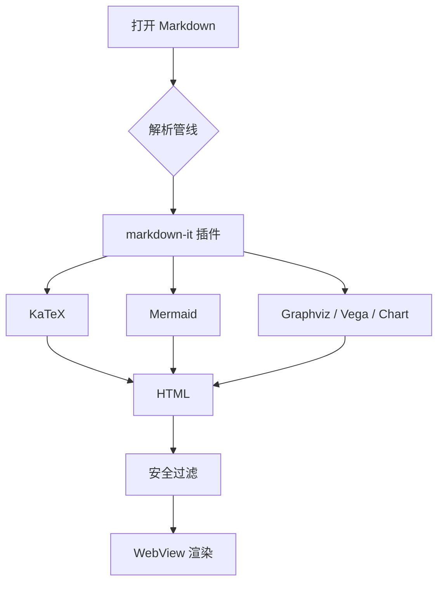
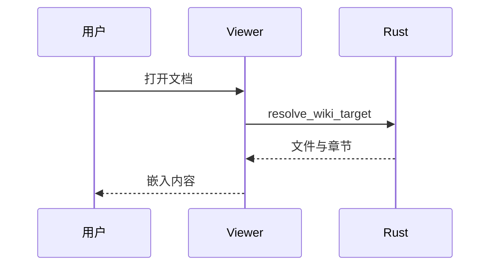
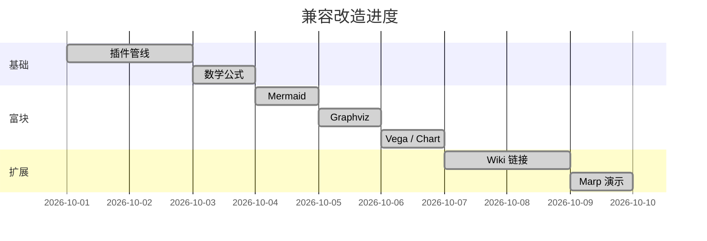
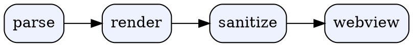

# OpenMD Markdown 兼容性总览

本文档用于展示和回归验证 OpenMD 当前适配的全部 Markdown 能力。
点击右上角“演示”可进入 Marp 幻灯片模式。

---

## 1. 基础文本

**加粗**、*斜体*、***粗斜体***、~~删除线~~、`行内代码`、普通链接与自动链接。

访问 [OpenAI](https://openai.com) 或直接输入 https://example.com 。

---

## 2. 标题层级

# H1
## H2
### H3
#### H4
##### H5
###### H6

---

## 3. 列表

- 无序列表
  - 嵌套项
    - 更深一层
- 第二项

1. 有序列表
2. 第二项
   1. 子步骤
   2. 子步骤

- [x] 已完成任务
- [ ] 未完成任务

---

## 4. 定义列表 / 缩写 / 上下标 / 高亮

Markdown
: 一种轻量级标记语言。

OpenMD
: 基于 Tauri 的本地优先 Markdown 查看器。

*[HTML]: HyperText Markup Language

HTML 是网页的基础。高亮：==重点内容==。

化学式 H~2~O，数学 x^2^，插入 ++新增文本++。

---

## 5. Emoji 与字符

:smile: :rocket: :warning: :white_check_mark: :x: :heart:

箭头 → ← ↑ ↓ ↔，符号 ± × ÷ ≠ ≤ ≥ ∞，破折号 — 与省略号…

---

## 6. 引用与 GitHub Alerts

> 普通引用。
>
> > 嵌套引用。

> [!NOTE]
> 需要注意的信息。

> [!TIP]
> 有帮助的建议。

> [!IMPORTANT]
> 关键信息。

> [!WARNING]
> 潜在风险。

> [!CAUTION]
> 可能造成负面后果。

> [!INFO]
> 补充信息。

> [!SUCCESS]
> 操作成功。

> [!QUESTION]
> 需要确认的问题。

> [!FAILURE]
> 失败的场景。

> [!DANGER]
> 危险操作。

> [!BUG]
> 已知缺陷。

> [!EXAMPLE]
> 使用示例。

> [!QUOTE] 自定义标题
> 引用式 Callout。

---

## 7. 代码高亮

```typescript
interface WikiTarget {
  path: string;
  content: string;
  section?: string;
}

async function resolve(target: string): Promise<WikiTarget> {
  return invoke("resolve_wiki_target", { target });
}
```

```rust
fn strip_verbatim_prefix(path: String) -> String {
    path.strip_prefix(r"\\?\").unwrap_or(&path).to_string()
}
```

```python
def fibonacci(n: int) -> int:
    return n if n < 2 else fibonacci(n - 1) + fibonacci(n - 2)
```

```diff
- old line
+ new line
```

支持语言：JavaScript、TypeScript、Python、Rust、Go、Bash、JSON、YAML、HTML/XML、CSS、SQL、Markdown、Java、C、C++、Shell、Diff、Dockerfile、TOML/INI、Kotlin、Ruby、PHP、Lua、PowerShell 等。

---

## 8. 表格

| 能力 | 状态 | 说明 |
|---|---|---|
| GFM 表格 | 已支持 | 基础表格与对齐 |
| 任务列表 | 已支持 | 只读复选框 |
| 代码高亮 | 已支持 | highlight.js |

对齐示例：

| 左对齐 | 居中 | 右对齐 |
|:---|:---:|---:|
| a | b | 1 |
| c | d | 2 |

MultiMarkdown 表格（跨列与标题）：

| 能力 | 分组 ||
|---|---|---|
| 跨列 | 合并单元格 ||

[表格标题示例]

---

## 9. 数学公式 KaTeX

行内公式：$E = mc^2$，欧拉恒等式 $e^{i\pi} + 1 = 0$。

块级公式：

$$
\int_{-\infty}^{\infty} e^{-x^2}\,dx = \sqrt{\pi}
$$

矩阵：

$$
\begin{pmatrix} a & b \\ c & d \end{pmatrix}
\begin{pmatrix} x \\ y \end{pmatrix}
=
\begin{pmatrix} ax + by \\ cx + dy \end{pmatrix}
$$

也支持 `\(...\)`、`\[...\]` 与 `\begin{equation}...\end{equation}`。

---

## 10. Mermaid 图表







---

## 11. Graphviz



---

## 12. Vega-Lite

```vega-lite
{
  "$schema": "https://vega.github.io/schema/vega-lite/v6.json",
  "description": "各语法支持数量",
  "data": {
    "values": [
      {"category": "基础", "count": 8},
      {"category": "扩展", "count": 12},
      {"category": "图表", "count": 5}
    ]
  },
  "mark": "bar",
  "encoding": {
    "x": {"field": "category", "type": "nominal"},
    "y": {"field": "count", "type": "quantitative"}
  }
}
```

---

## 13. Chart.js

```chart
{
  "type": "line",
  "data": {
    "labels": ["周一", "周二", "周三", "周四", "周五"],
    "datasets": [
      {
        "label": "渲染耗时 (ms)",
        "data": [120, 90, 110, 80, 70],
        "borderColor": "#0969da",
        "backgroundColor": "rgba(9,105,218,0.2)",
        "fill": true,
        "tension": 0.35
      }
    ]
  },
  "options": {
    "plugins": { "legend": { "display": true } }
  }
}
```

---

## 14. image 图注与尺寸


带尺寸属性：

{width=120}

---

## 15. 原始 HTML 与安全边界

<details open>
<summary>点开查看</summary>

原始 HTML、SVG、MathML、媒体标签和自定义元素都会被保留。

</details>

<kbd>Ctrl</kbd> + <kbd>Shift</kbd> + <kbd>O</kbd>

自定义元素：

<openmd-badge>自定义标签</openmd-badge>

脚本、事件处理器、`srcdoc` 与危险协议会被移除，iframe 会被强制添加 sandbox。

---

## 16. Wiki 链接与 Obsidian 嵌入

Wiki 链接：[[mermaid-test]]、[[mermaid-test|图表测试]]、[[mermaid-test#验证点]]。

图片嵌入：

![[../public/logo.png]]

文档嵌入：

![[mermaid-test#Mermaid 架构图测试]]

---

## 17. Marp 演示模式

frontmatter 中声明 `marp: true` 后，预览右上角会出现“演示”按钮。

- `←` / `→`、`PageUp` / `PageDown`、空格翻页
- `Home` / `End` 跳到首尾
- `Esc` 退出

`---` 会分页，但代码块内的 `---` 与 setext 标题下划线不会分页。

```yaml
marp: true
title: A deck
---
key: value
```

---

# 结束

如果你的确看到上述所有元素都正确渲染，说明 OpenMD 的 Markdown 兼容层已完整生效。
