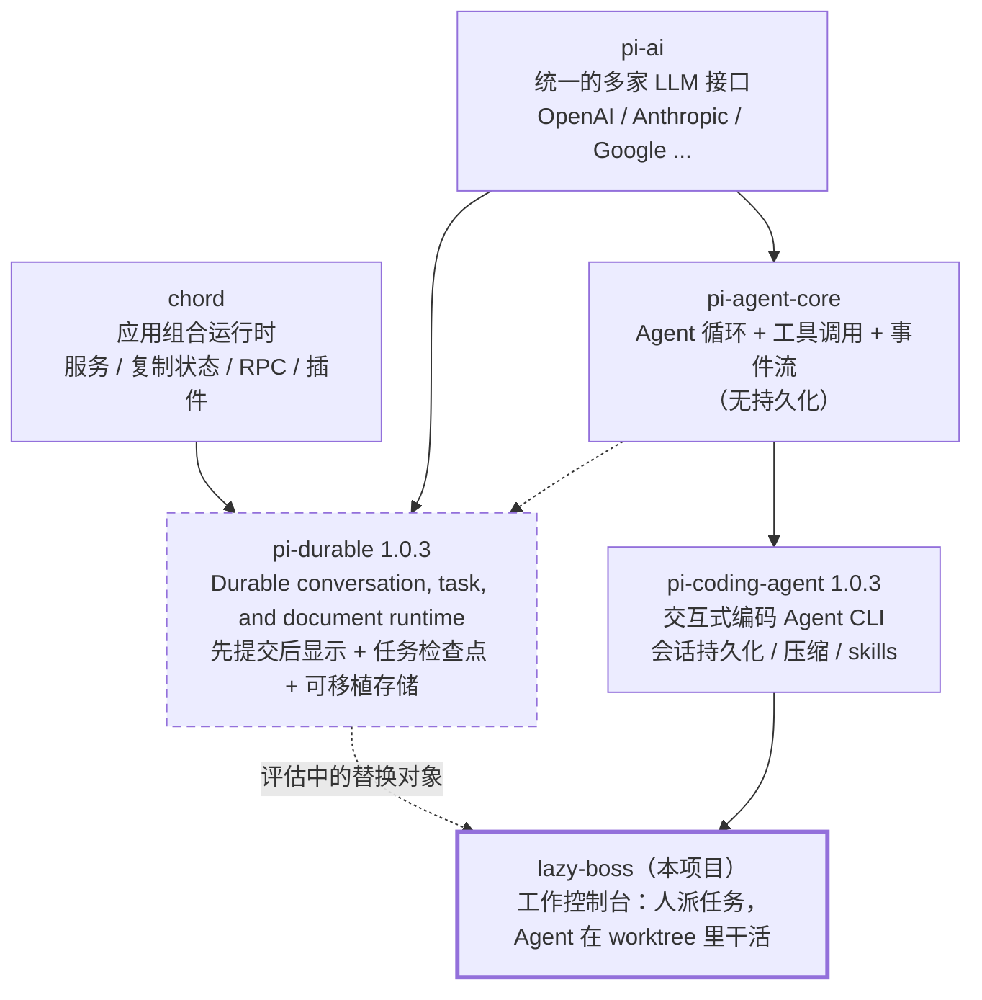

# Mermaid 架构图测试

下面这张图用于验证多行节点、虚线关系和自定义样式。

```mermaid
graph TD
    PIA["pi-ai<br/>统一的多家 LLM 接口<br/>OpenAI / Anthropic / Google ..."]
    CHORD["chord<br/>应用组合运行时<br/>服务 / 复制状态 / RPC / 插件"]
    CORE["pi-agent-core<br/>Agent 循环 + 工具调用 + 事件流<br/>（无持久化）"]
    CA["pi-coding-agent 1.0.3<br/>交互式编码 Agent CLI<br/>会话持久化 / 压缩 / skills"]
    DUR["pi-durable 1.0.3<br/>Durable conversation, task, and document runtime<br/>先提交后显示 + 任务检查点 + 可移植存储"]
    LAZY["lazy-boss（本项目）<br/>工作控制台：人派任务，Agent 在 worktree 里干活"]

    PIA --> CORE
    CORE --> CA
    PIA --> DUR
    CHORD --> DUR
    CORE -.-> DUR
    CA --> LAZY
    DUR -.->|"评估中的替换对象"| LAZY

    style DUR stroke-dasharray: 6 4
    style LAZY stroke-width:3px
```

## 验证点

- 节点内应保留多行文字。
- `CORE -.-> DUR` 和 `DUR -.-> LAZY` 应显示为虚线箭头。
- `DUR` 节点应显示虚线边框，`LAZY` 节点应显示加粗边框。
